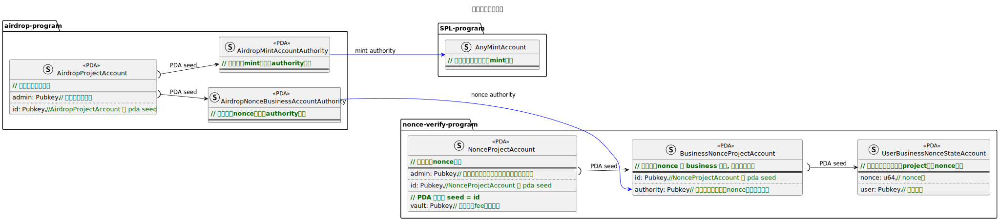
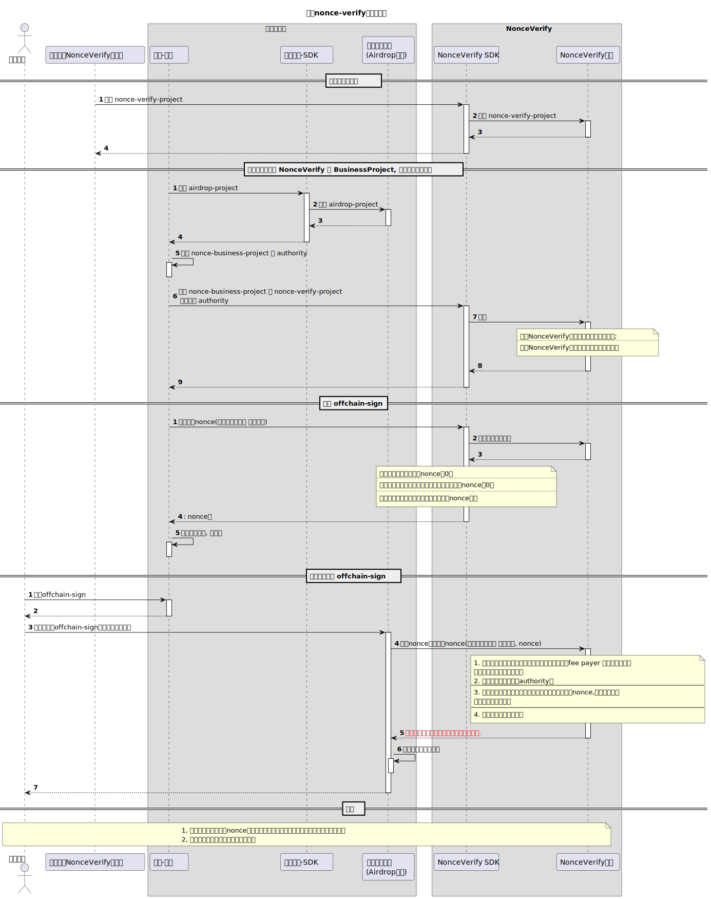

# 申领空投合约设计说明

## 账户关系图



## 业务流程图



## 业务流程的相关代码说明(如何和合约交互)

### 1. 准备： NonceVerify合约的Provider和Airdrop合约的Provider

```typescript
// nonce-verify合约的provider
const nonceVerifyProvider = new NonceVerifyProvider(connection);
```

```typescript
// airdrop合约的provider
const airdropProvider = new SolanaAirdropProvider(connection);
```

### 2. 创建 nonce-verify Account

```typescript
const nonceProjectId = Keypair.generate().publicKey;
const nonceAdminKeypair = Keypair.generate();

const initializeProjectParams: InitializeNonceProjectActionParams = {
  buildType: BuildType.SendAndFinalizeTx,
  cuPrice: 1 * 10 ** 6,
  cuFactor: DEFAULT_CU_FACTOR,

  businessFee: 8,
  userFee: 9,

  registerBusinessNeedVerify: false,

  payer: GlobalPayerKeypair.publicKey,
  payerKeypair: GlobalPayerKeypair,

  projectId: nonceProjectId,

  admin: nonceAdminKeypair.publicKey,
  adminKeypair: nonceAdminKeypair,
};

const txId = (await nonceVerifyProvider.initializeNonceProjectAction(
  initializeProjectParams
)) as string;
console.log(
  `initialize-nonce-project transaction txId: ${txId}, has finitialized`
);
```

### 3. 创建airdrop Account

```typescript
// 初始化一个 airdrop-project
const txIdInitAirdropProject =
  await airdropProvider.initializeAirdropProjectAction({
    buildType: BuildType.SendAndFinalizeTx,
    cuPrice: 1 * 10 ** 6,
    cuFactor: DEFAULT_CU_FACTOR,
    payer: GlobalPayerKeypair.publicKey,
    payerKeypair: GlobalPayerKeypair,
    projectId: airdropProjectId,
    projectAdmin: airdropProjectAdminKeypair.publicKey,
  });
```

### 4. 计算 Business-Nonce-Project 的authority， 并使用它创建 business-nonce-project account

```typescript
// 计算 business-nonce-project 的authority
const nonceVerifyBusinessProjectAuthority =
  await airdropProvider.findNonceVerifyBusinessAuthorityAddress({
    airdropProjectPubkey: airdropProjectAddress,
    nonceVerifyBusinessProjectPubkey: businessProjectAddress,
  });

const projectId = Keypair.generate().publicKey;

const registerBusinessProjectParams: RegisterBusinessProjectActionParams = {
  buildType: BuildType.SendAndFinalizeTx,
  cuPrice: 1 * 10 ** 6,
  cuFactor: DEFAULT_CU_FACTOR,

  projectId: projectId,
  projectAuthority: nonceVerifyBusinessProjectAuthority,

  payer: GlobalPayerKeypair.publicKey,
  payerKeypair: GlobalPayerKeypair,
  registerFeePayer: GlobalPayerKeypair.publicKey,
  registerFeePayerKeypair: GlobalPayerKeypair,

  nonceProjectId: nonceProjectId,
};

const nonceProjectPubkey =
  nonceVerifyProvider.findNonceProjectAddress(nonceProjectId);
const nonceVaultPubkey =
  nonceVerifyProvider.findNonceVaultAddress(nonceProjectId);

const nonceProjectBeforeBalance = await connection.getBalance(nonceVaultPubkey);

const txId2 = (await nonceVerifyProvider.registerBusinessProjectAction(
  registerBusinessProjectParams
)) as string;
```

### 5. 生成 off-sign 的待签名数据

```typescript
// 生成 off-sign 的待签名数据
const tsResultBuffer = await airdropProvider.buildClaimFtSignData({
  tokenAmount: amount,
  mintAccountPubkey: mintAddress,
  claimer: userAddress,
  airdropProjectPubkey: airdropProjectAddress,
  nonceVerifyBusinessProjectPubkey: nonceBusinessProjectAddress,
});
```

### 6. 使用管理员私钥进行签名

```typescript
const signature = AirdropUtils.sign(tsResultBuffer, airdropProjectAdminKeypair);
```

### 7. 组装领取空投的交易

```typescript
// buidType 取 InstructionArray 则是返回交易指令集合
const txId = await airdropProvider.claimFtAction({
  buildType: BuildType.SendAndFinalizeTx,
  cuPrice: 1 * 10 ** 6,
  cuFactor: DEFAULT_CU_FACTOR,

  payer: GlobalPayerKeypair.publicKey,
  payerKeypair: GlobalPayerKeypair,

  nonceFeePayer: aliceKeypair.publicKey,
  nonceFeePayerKeypair: aliceKeypair,

  claimer: aliceKeypair.publicKey,
  claimerKeypair: aliceKeypair,

  spaceFeePayer: aliceKeypair.publicKey,
  spaceFeePayerKeypair: aliceKeypair,

  airdropProjectPubkey: airdropProjectAddress,

  mintAccountPubkey: mintAddress,
  nonceVerifyBusinessProjectPubkey: nonceBusinessProjectAddress,

  tokenAmount: amount,
  signData: signData,
  signature: signature,
});
```

关于组装指令的细节，看developer.md中的说明。
